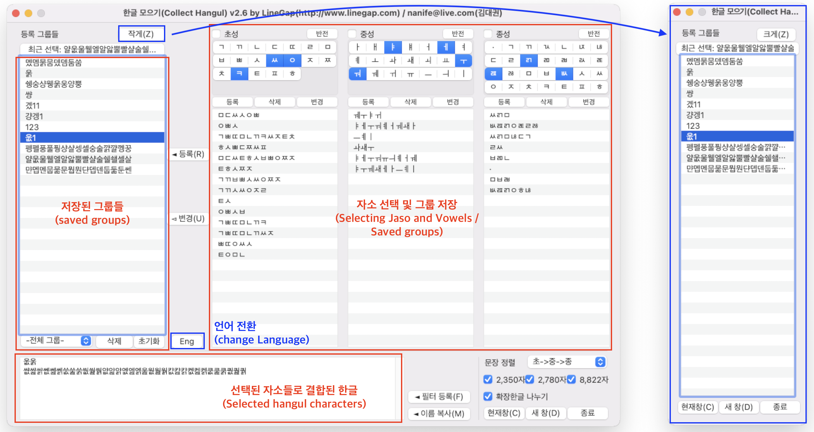
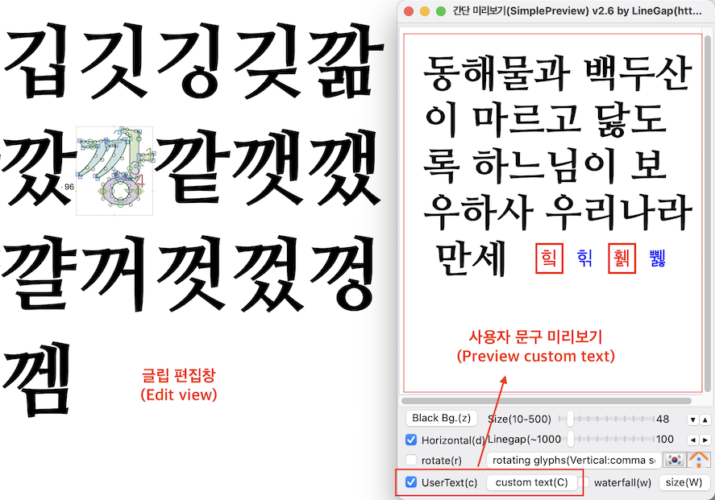
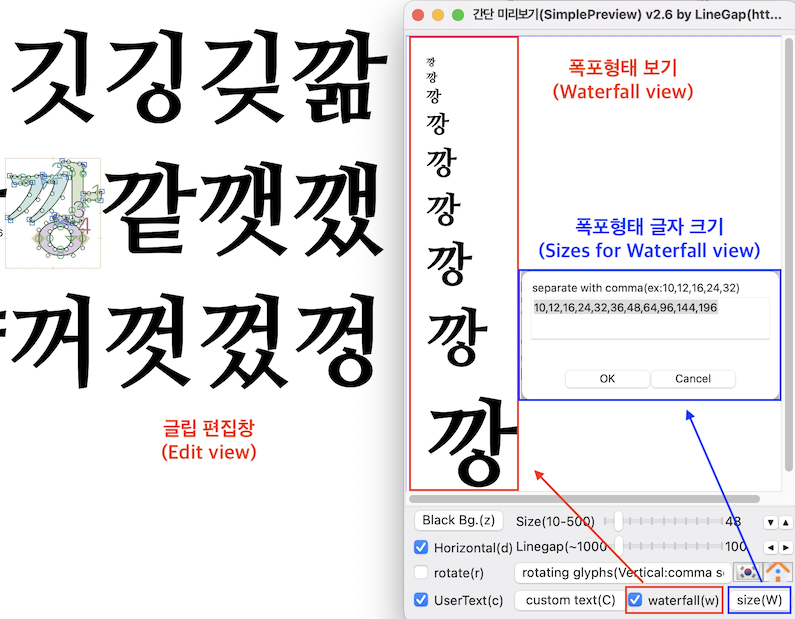
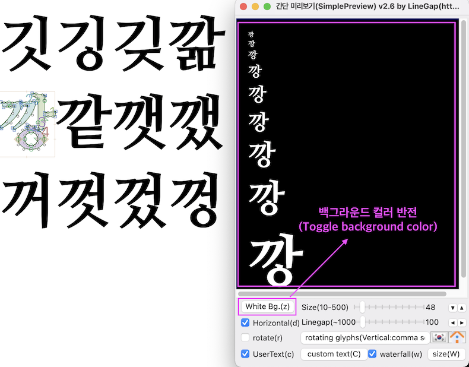
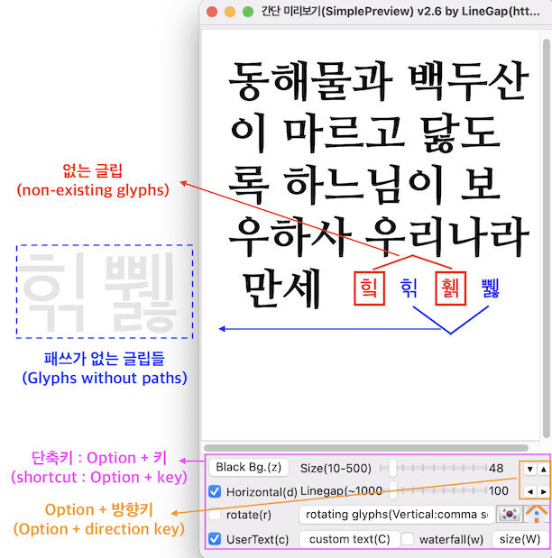
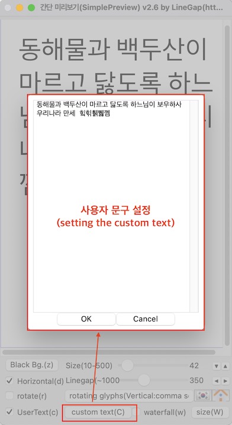

# 라인갭 스크립트(Linegap's Scripts for Glyphs App)
- **필요사항1(requirements)**
1. *창 > 플러그인 관리자 > 모듈* 에서 바닐라(Vanilla) 모듈 설치 필요(*vanilla* module that can be installed on *Windows > Plugin Manager > Module > Vanilla.*)
2. 등록(Registration) : 정식 등록은 <a href="http://www.linegap.com" target="_blank">라인갭 홈페이지</a>의 연락처를 통해 안내 받으실 수 있습니다.)(You need a paid registration by contacting me through the <a href="http://www.linegap.com" target="_blank">Linegap site</a>.)

- ## 한글모으기(CollectHangul) ##
초성, 중성, 종성 자소 선택으로 한글을 쉽게 입력하고 선택할 수 있습니다.(Lets you select or input Korean hangul characters easily by selecting consonants and vowels.)

 

- ## 간단미리보기(SimplePreview) ##
편집 중인 폰트의 글자들을 미리보기하는 플러그인으로, 세로쓰기 및 가로쓰기 모드를 지원(Lets you preview texts which is in the font you are editing.)

